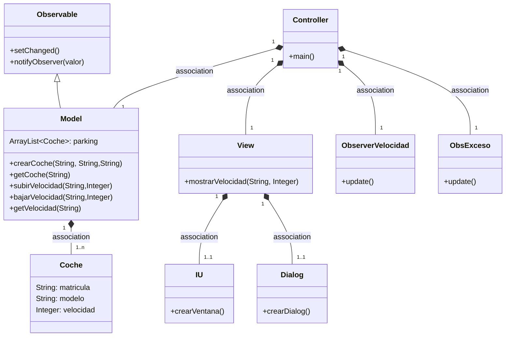
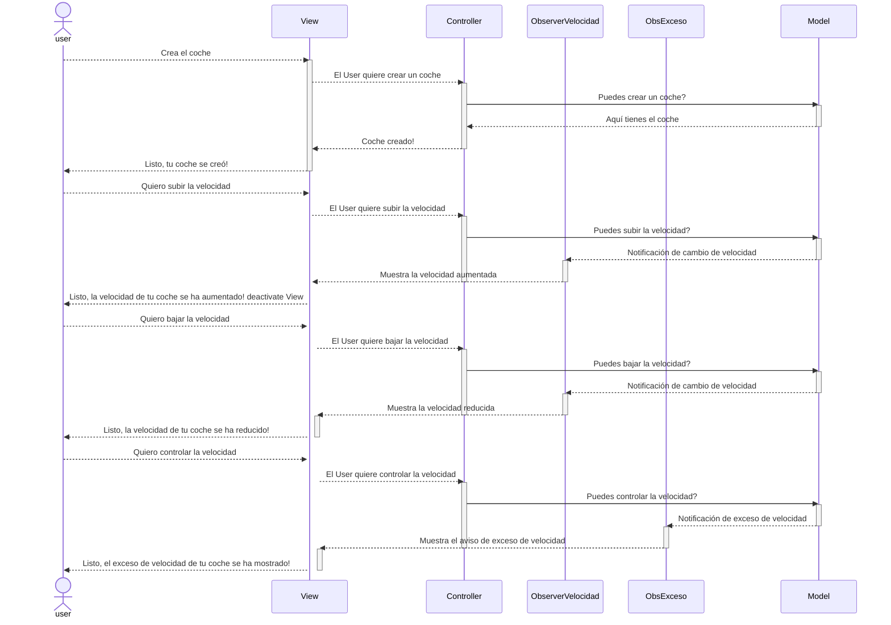

# Arquitectura MVC con Observer

En esta rama, utilizaremos el patrón Observer.
Los cambios de la velocidad que se hagan en el model serán observados por el Controller.
Para notificar a los observadores, hacemos dos pasos:
* Actualizamos el estado a 'algo ha cambiado' con `setChanged()`.
* Notificamos a los observadores `notifyObservers(valor)`.

De esta manera, se *dispara* en todos los observadores el método `update()`.

Aplicación que trabaja con objetos coches,los crea, modifica la velocidad y la muestra.

---
## Diagrama de clases:



---

## Diagrama de Secuencia
Qué ocurre cuando se cambia la velocidad.



El mismo diagrama con los nombres de los métodos
```mermaid
sequenceDiagram
        actor user    
        participant IU
        participant Dialog
        participant View
        participant Controller
        participant ObserverVelocidad
        participant ObsExceso
        participant Model
    
    user-->>IU: Crea el coche
    IU-->Controller: crearCoche(modelo,matricula)
    activate Controller
    Controller->>Model: crearCoche(modelo, matricula)
    activate Model
    Model-->>Controller: Aquí tienes el coche
    deactivate Model
    Controller-->>+View: mostrarVelocidad(matricula, velocidad)
    deactivate Controller
    View-->>-Dialog: crearDialog(mensaje)
    
    user-->>IU: Sube la velocidad del coche
    IU-->>Controller: aumentarVelocidad(matricula,velocidad)
    activate Controller
    Controller->>Model: subirVelocidad(matricula,velocidad)
    activate Model
    Model-->>ObserverVelocidad: update()
    deactivate Model
    activate ObserverVelocidad
    ObserverVelocidad-->>+View: mostrarVelocidad(matricula, velocidad)
    deactivate ObserverVelocidad
    deactivate Controller
    View-->>-Dialog: crearDialog(mensaje)
    
    user-->>IU: Baja la velocidad del coche
    IU-->>Controller: reducirVelocidad(matricula,velocidad)
    activate Controller
    Controller->>Model: bajarVelocidad(matricula,velocidad)
    activate Model
    Model-->>ObserverVelocidad: update()
    deactivate Model
    activate ObserverVelocidad
    ObserverVelocidad-->>+View: mostrarVelocidad(matricula, velocidad)
    deactivate ObserverVelocidad
    deactivate Controller
    View-->>-Dialog: crearDialog(mensaje)
    
    user-->>IU: Controla la velocidad del coche
    IU-->>Controller: aumentarVelocidad(matricula,velocidad)
    activate Controller
    Controller->>Model: aumentarVelocidad(matricula,velocidad)
    activate Model
    Model-->>ObsExceso: update()
    deactivate Model
    activate ObsExceso
    ObsExceso-->>+View: excesoVelocidad(matricula, velocidad)
    deactivate ObsExceso
    deactivate Controller
    View-->>-Dialog: crearDialog(mensaje)
    
   ```

---
## Pasos para la configuración.

1. Model
    * Extender `Observable` en `Model`.
    * En el método en donde ocurra el cambio:
        * setChanged()
        * notifyObserver(valor)
2. Crear una clase que sea el observador, que implementa la interface `Observer`.
    * Definir el método `update()`
3. Controller
    * Instanciar el observer, definido en el punto anterior.
    * Añadir este observer al observable con `addObserver()`.