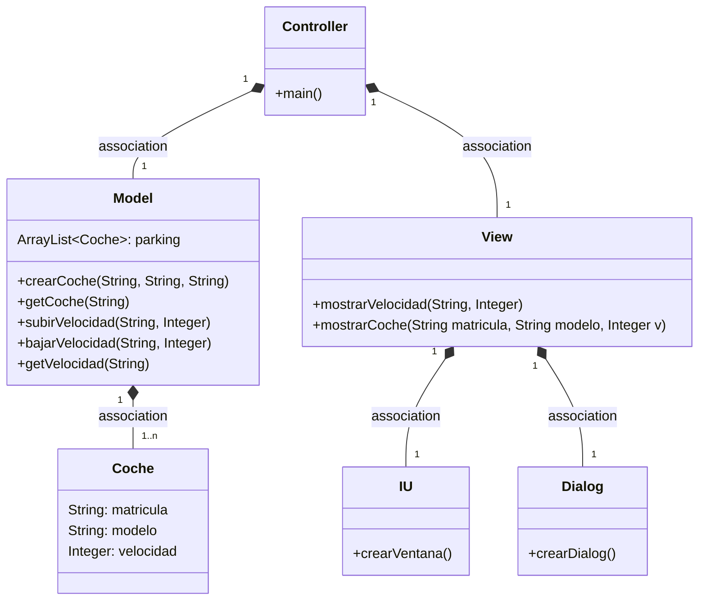
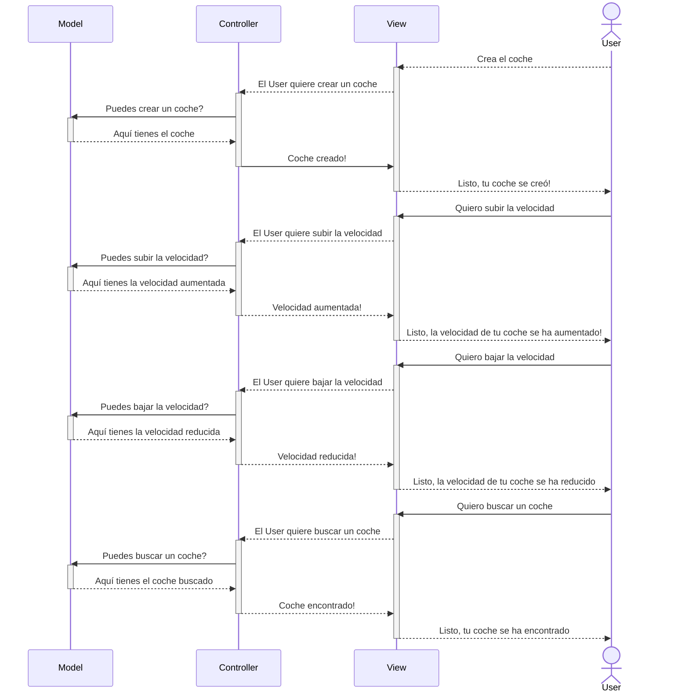

# Arquitectura MVC

Aplicación que trabaja con objetos coches, los crea, modifica la velocidad y la muestra.
Añadimos método para buscar un coche.
---
## Diagrama de clases:



---

## Diagrama de Secuencia

Ejemplo básico del procedimiento, sin utilizar los nombres de los métodos.




El mismo diagrama con los nombres de los métodos.

```mermaid
sequenceDiagram
    participant Model
    participant Controller
    participant View
    participant Dialog
    participant IU
    actor User
    
    User-->>IU: Crea el coche
    IU-->Controller: crearCoche(modelo,matricula)
    activate Controller
    Controller->>Model: crearCoche(modelo,matricula)
    activate Model
    Model-->>Controller: Coche
    deactivate Model
    Controller-->>+View: mostrarVelocidad(matricula,velocidad)
    deactivate Controller
    View-->>-Dialog: crearDialog(mensaje)
       
    User-->>IU: Sube la velocidad del coche
    IU-->Controller: aumentarVelocidad(matricula,velocidad)
    activate Controller    
    Controller->>Model: subirVelocidad(matricula, velocidad)
    activate Model
    Model-->>Controller: El coche con la velocidad aumentada
    deactivate Model
    Controller->>+View: mostrarVelocidad(matricula, velocidad)
    deactivate Controller
    View-->>-Dialog: crearDialog(mensaje)
    
    User-->>IU: Baja la velocidad del coche
    IU-->Controller: reducirVelocidad(matricula,velocidad)
    activate Controller       
    Controller->>Model: bajarVelocidad(matricula, velocidad)
    activate Model
    Model-->>Controller: El coche con la velocidad reducida
    deactivate Model
    Controller-->>+View: mostrarVelocidad(matricula,velocidad)
    deactivate Controller
    View-->>-Dialog: crearDialog(mensaje)
    
    User-->>IU: Busca un coche
    IU-->Controller: buscarCoche(matricula)
    activate Controller       
    Controller->>Model: getCoche(matricula)
    activate Model
    Model-->>Controller: El coche buscado
    deactivate Model
    Controller-->>+View: mostrarCoche(matricula,modelo,v)
    deactivate Controller
    View-->>-Dialog: crearDialog(mensaje)
    
   ```